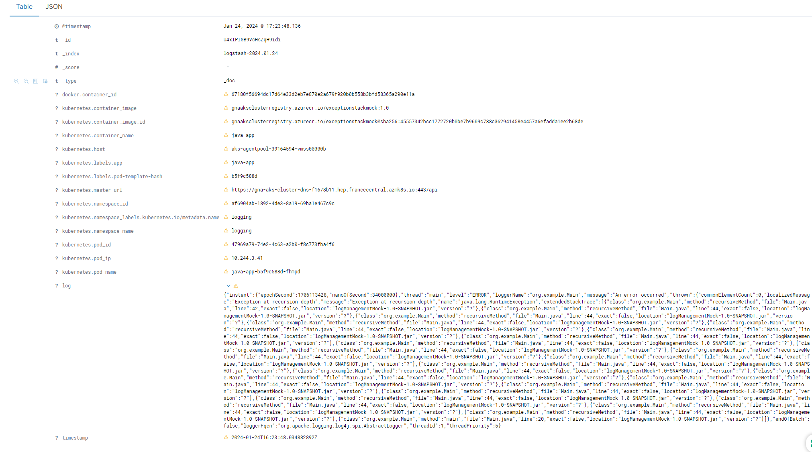
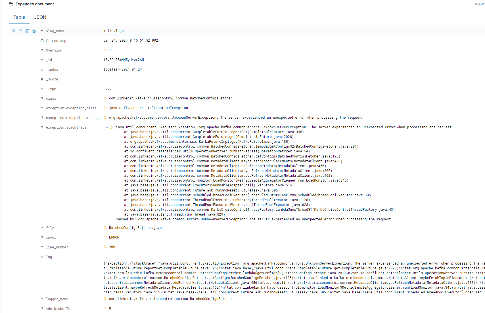

# Demo Repository: JSON Logging Scenarios in Kubernetes with fluentd

Demo Using json layout with log4j 1.x. (confluent node) and log4j2 (custom java application) to send logs to elasticsearch via fluentd.

## Repository Structure

### Java Client Application (log4j2 Scenario)
- `src/main/java/org/example/Main.java`: Sample Java application generating log messages.
- `src/main/resources/log4j2.xml`: Log4j2 configuration for formatting logs as JSON.
- `Dockerfile`: Dockerfile for creating a custom Docker image.
- `build.gradle`: Gradle build file for managing dependencies.
- `java-app.yaml`: Kubernetes configuration for deploying the Java client application.
- `elastic_search.yaml`: Elasticsearch configuration for scenario 1.
- `fluent-rbac.yaml`: Kubernetes Role-Based Access Control (RBAC) for Fluentd in scenario 1.
- `fluentd-configmap.yaml`: ConfigMap for Fluentd configuration in scenario 1.
- `fluentd-daemonset.yaml`: DaemonSet for Fluentd in scenario 1.
- `kibana.yml`: Kibana configuration for scenario 1.
  

### Kafka Nodes (log4j 1.x Scenario)
- `confluent/Dockerfile`: Dockerfile for extending Confluent Kafka image.
- `confluent/confluent-platform-singlenode.yaml`: Kubernetes configuration for setting up Confluent Kafka.
- `confluent/elastic_search.yaml`: Elasticsearch configuration.
- `confluent/fluent-rbac.yaml`: Kubernetes Role-Based Access Control (RBAC) for Fluentd.
- `confluent/fluentd-configmap.yaml`: ConfigMap for Fluentd configuration.
- `confluent/fluentd-daemonset.yaml`: DaemonSet for Fluentd.
- `confluent/kibana.yml`: Kibana configuration.
- `confluent/fluentd-configmap.yaml`: ConfigMap for Fluentd configuration.
  
## Details

### Java Client Application (log4j2 Scenario)
1. Configure log4j2 to format logs as JSON.
2. Build the custom Docker image using the provided Dockerfile.
3. Configure Fluentd to parse and forward the logs to Elasticsearch for visualization in Kibana.

### Kafka Nodes (log4j 1.x Scenario)
1. Extend the Confluent Kafka image with the custom Dockerfile.
2. Provide configOverrides to the Kafka nodes to use log4j 1.x with log4j-jsonevent-layout.
3. Configure Fluentd to parse and forward the logs to Elasticsearch for visualization in Kibana.

